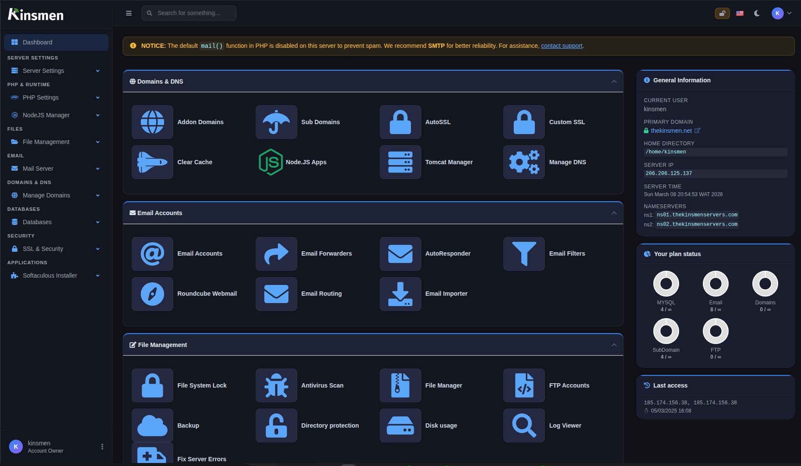
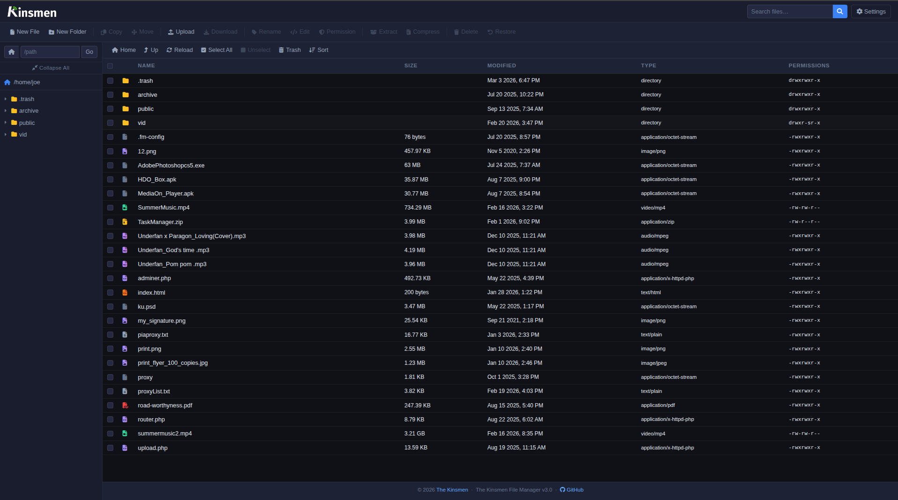
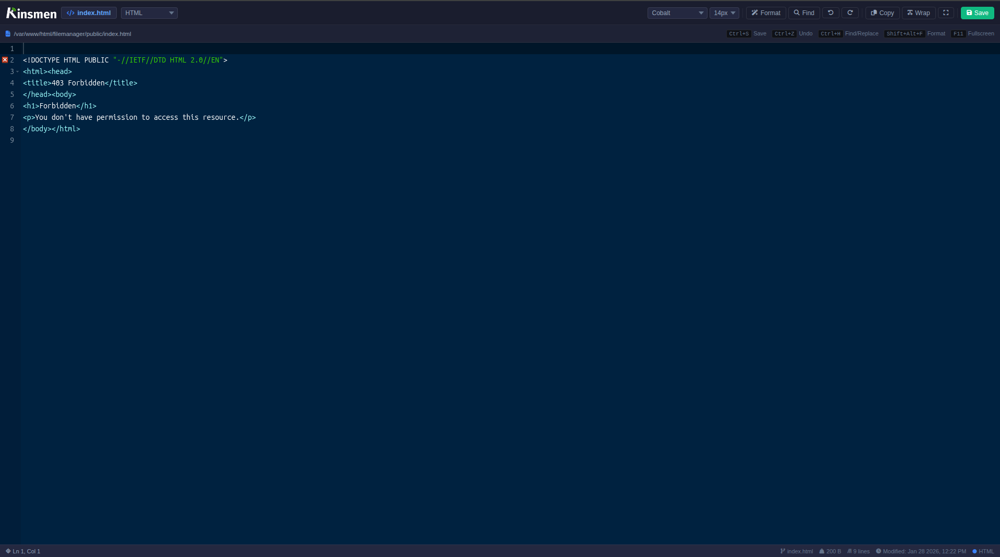

# CWP User Panel - Modernized Theme & Code Editor

This repository contains a complete modification of the **CWP User Panel**, enhancing the look and functionality of the default `original` theme. The new design provides a **clean dashboard**, a **modernized user experience**, and an improved **file manager code editor**.





## ✨ Features

- **Revamped UI**: A fresh and modern look for the CWP user panel, making it more visually appealing and user-friendly.
- **General Information Panel**: Similar to cPanel, displaying system details in an organized way.
- **SSL Padlock Validator**: Easily verify the SSL status of your domains.
- **Enhanced File Manager Code Editor**:
  - **Based on Ace Editor** – a powerful and lightweight editor.
  - **Search & Replace** – find and replace text effortlessly.
  - **Code Formatting** – automatically format your code for readability.
  - **Undo & Redo** – revert or reapply changes with ease.
  - **Multiple Themes** – choose from different editor themes.
  - **Adjustable Font Size** – customize your coding experience.

## 📌 Installation Instructions

⚠️ **Backup First!** Before proceeding, create a backup of your existing CWP files to prevent data loss.

1. **Backup your existing CWP files**:

   ```bash
   cp -r /usr/local/cwpsrv/var/ /usr/local/cwpsrv/var_backup
   ```

2. **Clone this repository and overwrite the existing files**:

   ```bash
   git clone https://github.com/yourusername/cwp-modern-theme.git /usr/local/
   ```

3. **Restart CWP services to apply changes**:
   ```bash
   systemctl restart cwpsrv
   ```
4. **\*Clear browser cache to see the new changes.**

## Custom logo and icon

Upload custom logo and icon to the `img` folder in the cloned repo.
PS: Logo must be name `logo.png` and Icon `icon.png`

## ⚠️ Disclaimer

This modification overwrites the default original theme and built-in code editor. If you want to restore the default theme, simply replace `/usr/local/cwpsrv/var/` with your backup.

🎨 Enjoy the modernized CWP User Panel with a sleek new interface and a powerful file manager! 🚀
Contributions and improvements are always welcome. Feel free to fork and submit pull requests.

📩 Need help? Open an issue or reach out!
